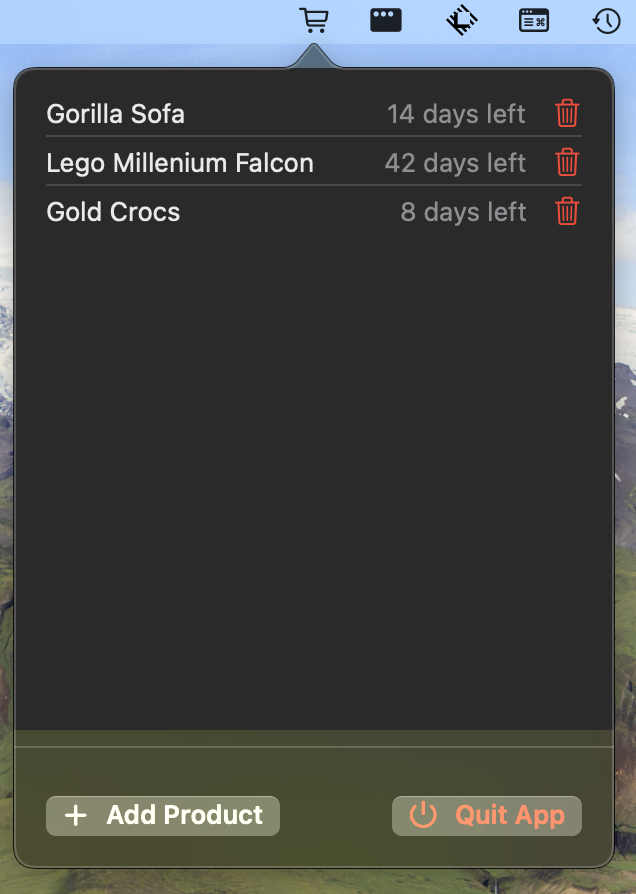

# WaitList

**WaitList** is a simple and intuitive macOS menubar app designed to help you combat impulse buying. By encouraging a waiting period before making non-essential purchases, WaitList assists you in making more mindful spending decisions.


## Table of Contents

- [Features](#features)
- [Installation](#installation)
- [Usage](#usage)
- [Screenshots](#screenshots)
- [License](#license)
- [Contributing](#contributing)
- [Contact](#contact)

## Features

- **Add Items to Wait List**: Easily add products you feel the urge to buy by specifying the product name and a waiting period in days.
- **Automatic Reminders**: Receive a notification when the waiting period is over to reassess if you still need the item.
- **Manage Your List**: View all active items in your wait list directly from the menubar.
- **Flexible Waiting Periods**: Choose a waiting time that suits you—whether it's a few days or a couple of weeks.
- **Manual Removal**: Option to remove items from the list before the waiting period ends if you've changed your mind.

## Installation

1. **Download the Latest Release**: Get the `WaitList.zip` file from the [Releases](https://github.com/CemAlpturk/WaitList/releases) page.

2. **Unzip the File**: Double-click the downloaded `.zip` file to extract the `WaitList.app`.

3. **Move to Applications Folder**: Drag and drop `WaitList.app` into your `Applications` folder for easy access.

4. **Launch the App**:
   - Double-click `WaitList.app` from your Applications folder.
   - You may need to right-click and select **Open** if macOS warns that the app is from an unidentified developer.

5. **(Optional) Add to Startup Items**:
   - Go to **System Preferences > Users & Groups > Login Items**.
   - Click the **+** button and add `WaitList.app` to start it automatically at login.

## Usage

1. **Access the Menubar Icon**: Once launched, WaitList appears as an icon in your menubar (a clock or custom icon).

2. **Add a New Item**:
   - Click the WaitList icon in the menubar.
   - Click on **Add Product**.
   - Enter the product name and select a waiting period in days (e.g., 7, 14).
   - Click **Add** to save the item to your wait list.

3. **View Active Items**:
   - Click the WaitList icon to see all items currently in your wait list along with the remaining days.

4. **Remove an Item**:
   - To remove an item before the waiting period ends, click the trash icon next to the product name.

5. **Receive Notifications**:
   - When the waiting period for an item is over, you'll receive a notification prompting you to reevaluate your desire to purchase the item.

## Screenshots

 \
*WaitList showing active items and remaining days.*

 \
*Notification when waiting period is over.*

## License

WaitList is released under the [MIT License](LICENSE). You are free to use, modify, and distribute this software as per the terms of the license.

## Contributing

Contributions are welcome! If you have suggestions for improvements or have found a bug, please open an issue or submit a pull request.

1. **Fork the Repository**: Click on the **Fork** button at the top right of the repository page.

2. **Create a Feature Branch**:
```bash
git checkout -b feature/YourFeatureName
```
3. **Commit your changes**:
```bash
git commit -m "Add your message here"
```
4. **Push to Your Fork**:
```bash
git push origin feature/YourFeatureName
```
5: **Open a Pull Request**: Navigate to your fork on GitHub and open a pull request to the main repository.

## Contact
For support, questions or feedback:

- **Email**: [cem.alpturk@gmail.com](cem.alpturk@gmail.com)
- **Issues**: [GitHub Issues](https://github.com/CemAlpturk/WaitList/issues)


    
