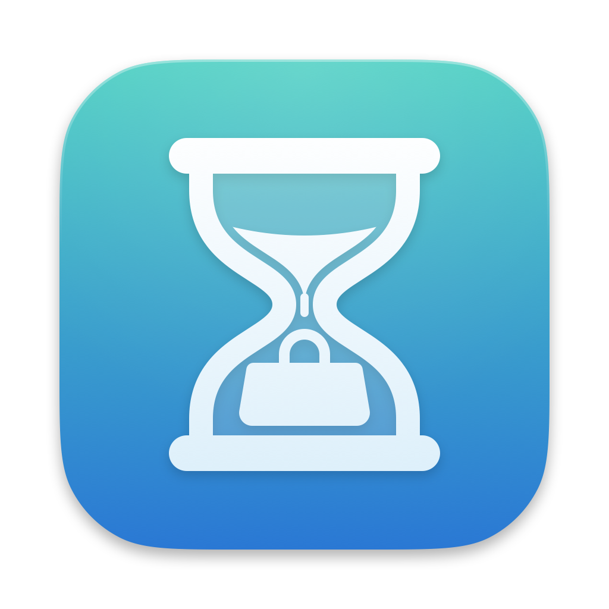
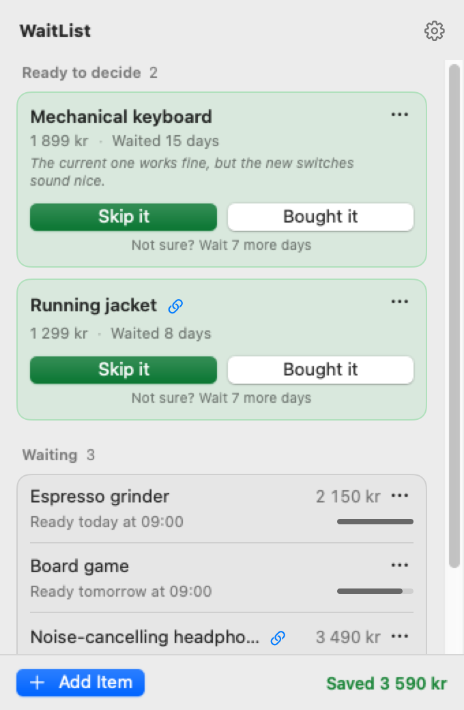
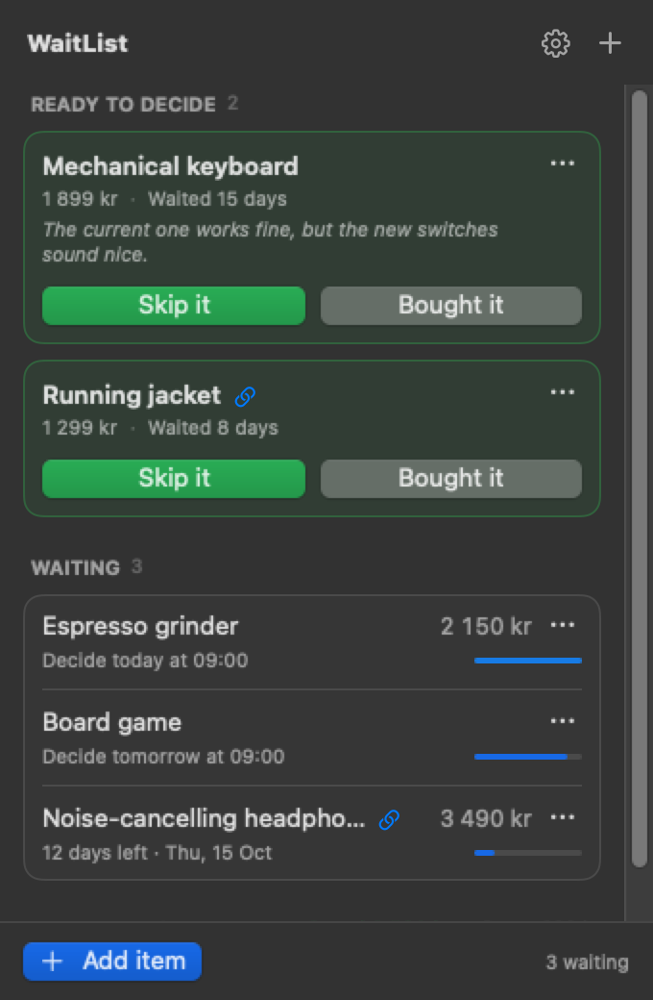
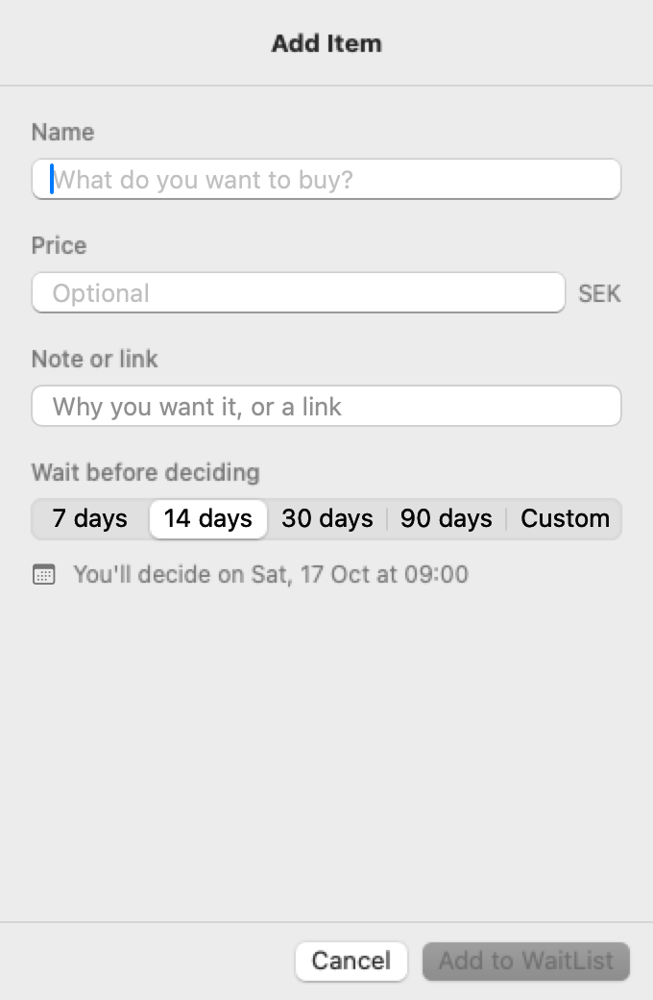
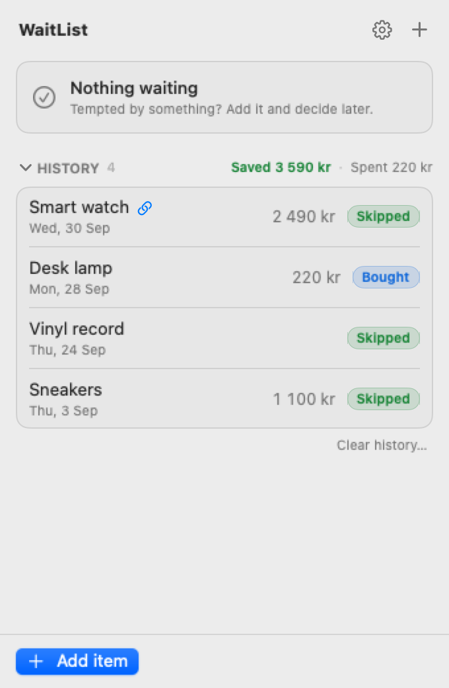
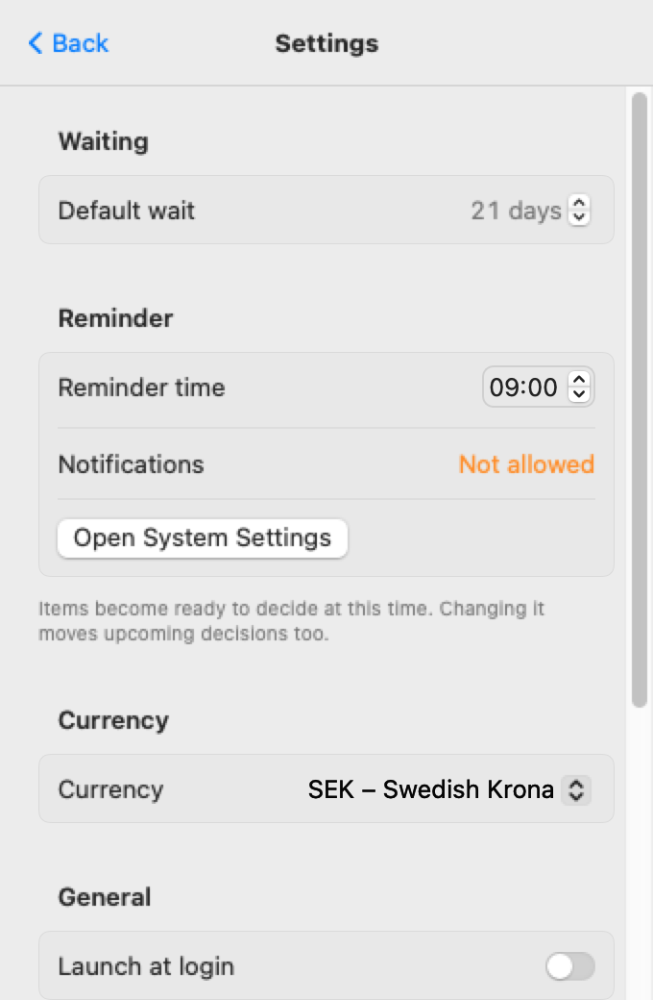

# WaitList

**WaitList** is a small macOS menubar app that fights impulse buying. Add the thing you want, give it a waiting period, and decide when the time is up. Most impulses fade. The ones that do not are worth buying.

Version 2.0 is a rewrite from scratch. Items saved by WaitList 1.x are imported the first time you launch it.

<div align="center">
  <figure>
    
  </figure>
</div>

## Table of Contents

- [Features](#features)
- [Installation](#installation)
- [Usage](#usage)
- [Screenshots](#screenshots)
- [Your Data](#your-data)
- [Building from Source](#building-from-source)
- [Development](#development)
- [License](#license)
- [Contributing](#contributing)
- [Contact](#contact)

## Features

- **Lives in the menubar**: No Dock icon and no windows. Left click the icon to open a popover. Right click it for a menu with Open, Add Item, Settings and Quit.
- **Add items with some context**: A name, an optional price, an optional note or link, and a waiting period.
- **Flexible waiting periods**: Pick 7, 14, 30 or 90 days, or enter any number from 1 to 365. You choose the default.
- **Progress at a glance**: Every waiting item shows a thin progress bar and how many days are left.
- **A reminder at the right time**: When the period ends, the item moves to a "Ready to decide" section and a macOS notification appears. The default time is 09:00, and you can change it.
- **Decide your way**: **Skip it**, **Bought it** or **Wait 7 more days**, from the notification or from the popover. You can also decide early, edit an item, or delete it.
- **History with totals**: Every decision is kept. The history shows "Saved X · Spent Y", so you can see how much impulse money you did not spend.
- **Nothing is deleted for you**: Items only leave the list when you delete them or clear the history. After deciding, you can undo for a few seconds.
- **A badge on the icon**: A number next to the menubar icon shows how many items are ready to decide.
- **Plain data**: Your list is one JSON file that you can read and back up.
- **Light and dark mode**: WaitList follows the system appearance.

## Installation

WaitList needs **macOS 14 Sonoma or later**.

1. **Download the Latest Release**: Get the `WaitList.zip` file from the [Releases](https://github.com/CemAlpturk/WaitList/releases) page.

2. **Unzip the File**: Double-click the downloaded `.zip` file to extract `WaitList.app`.

3. **Move to Applications Folder**: Drag `WaitList.app` into your `Applications` folder.

4. **Launch the App**:
   - The app is ad-hoc signed, not notarized, so macOS will warn you the first time.
   - Right-click `WaitList.app`, choose **Open**, and confirm.
   - If that does not work, open **System Settings > Privacy & Security**, find the message about WaitList, and allow it.

5. **Allow Notifications**: WaitList asks for permission to send notifications when it starts. Say yes, or the reminders will not appear. You can change this later in System Settings. The Settings screen in WaitList shows the current status and has a shortcut.

6. **(Optional) Launch at Login**: Open WaitList's settings and turn on **Launch at login**. If macOS asks for approval, use the **Open Login Items** button that appears there.

## Usage

1. **Open the App**: WaitList appears as a small icon in your menubar.
   - Left click opens the popover.
   - Right click shows a menu: **Open WaitList**, **Add Item…**, **Settings…** and **Quit WaitList**.

2. **Add an Item**:
   - Click the **+** button (or **Add item**) in the popover. In the popover, ⌘N does the same.
   - Enter a name. The price and the note are optional. A note can be plain text or a link, and a link gets a small link icon that opens it.
   - Pick a waiting period: 7, 14, 30 or 90 days, or **Custom** for 1 to 365 days. The screen shows the exact date and time you will decide.
   - Click **Add to WaitList**.

3. **Wait**: Waiting items show a thin progress bar and a line like "12 days left" with the date. In the last two days it reads "Decide tomorrow at 09:00" or "Decide today at 09:00".

4. **Decide**: When the period ends, at your reminder time, the item moves to **Ready to decide** and a notification appears with three actions:
   - **Skip it**: You do not need it. It goes to your history as money not spent.
   - **Bought it**: You still wanted it and bought it.
   - **Wait 7 more days**: Not sure yet. The decision moves back by 7 days (counted from today if the item is already due).

   Clicking the notification itself opens the popover. The same actions are on each item in the popover.

5. **Change Your Mind Early**: Use the **⋯** button on an item, or right-click it.
   - **Decide now** to skip or buy before the period ends.
   - **Wait 7 more days** to extend it.
   - **Edit…** to change the name, price or note.
   - **Delete…** to remove it. WaitList asks you to confirm first.

6. **Review Your History**:
   - Decided items go to the **History** section, which you can expand and collapse.
   - Its header shows "Saved X · Spent Y". Saved is the total price of skipped items. Spent is the total price of items you bought. Items without a price count as zero. If no item has a price, you see counts instead.
   - After you decide, an **Undo** button stays on screen for a few seconds. Later, right-click an item in History and choose **Undo decision**.
   - **Clear history…** removes all decided items and starts the totals over. WaitList asks you to confirm.

7. **Adjust Settings**: Click the gear icon in the popover (or press ⌘,).
   - **Default wait**: The waiting period suggested for new items. The default is 14 days.
   - **Reminder time**: When items become ready to decide. The default is 09:00. Changing it also moves your upcoming decisions to the new time.
   - **Notifications**: Shows whether macOS allows them, with a shortcut to System Settings.
   - **Currency**: The currency for prices. It starts as your region's currency (or USD if your region has none). Prices are shown in it, with no conversion.
   - **Launch at login**.
   - **Data**: Shows where your data file is and opens it in Finder.
   - **Quit WaitList**.

## Screenshots

<p align="center">
  
  
</p>
<p align="center"><em>Items ready to decide and items still waiting, in light and dark mode.</em></p>

<p align="center">
  
  
</p>
<p align="center"><em>Adding an item, and the history with its totals.</em></p>

<p align="center">
  
</p>
<p align="center"><em>Default wait, reminder time, currency and more.</em></p>

## Your Data

WaitList keeps your items in one file:

```
~/Library/Application Support/WaitList/items.json
```

- It is plain, pretty-printed JSON (`{"version": 1, "items": [...]}`), so you can open it, inspect it, or back it up by copying it.
- Every change is saved right away. The file is replaced in one step, so a crash cannot leave half a file.
- If the file cannot be read, WaitList moves it aside as `items.corrupt-<date>-<time>.json` in the same folder, starts with an empty list, and tells you where the old file is. It never overwrites it.
- If the file was written by a newer version of WaitList, or cannot be read for another reason, it is left untouched. WaitList tells you, and does not save any changes until you restart it, so the file is never overwritten.
- If WaitList cannot save a change, it shows a message in the popover.
- Your settings (default wait, reminder time, currency) are stored in macOS preferences, not in this file.
- **Coming from 1.x**: Items saved by WaitList 1.x are imported once, on first launch. They keep their names. Each one becomes due on the same day as before, at your reminder time.

## Building from Source

You do not need Xcode. You only need the Command Line Tools with Swift 5.10 or later:

```bash
xcode-select --install
```

Then, from the repository root:

```bash
make run
```

| Command | What it does |
| --- | --- |
| `make app` | Builds `build/WaitList.app` (a release build, ad-hoc signed). Use `make app CONFIG=debug` for a debug build. |
| `make run` | Quits a running WaitList, builds the app, and launches it. |
| `make test` | Runs the unit tests. |
| `make icon` | Regenerates the app icon and menubar glyphs from `Tools/make-icon.swift`. |
| `make release` | Builds the app and zips it to `build/WaitList.zip`. |
| `make build` | Compiles with SwiftPM only, with no app bundle. |
| `make stop` | Quits a running WaitList. |
| `make clean` | Removes `.build` and `build`. |

The package also opens in Xcode if you prefer: open `Package.swift`.

The code is split into two targets:

- `Sources/WaitListCore`: the model, store, saving, scheduling and settings. No UI, and covered by the unit tests in `Tests/WaitListCoreTests`.
- `Sources/WaitList`: the menubar app, with the AppKit lifecycle, notifications and SwiftUI views.

`swift Tools/make-icon.swift --help` lists the icon options. For example, `--concept b` exports a different design, and `--previews` renders comparison images into `build/icon-previews/`.

The app version lives in `Packaging/Info.plist` and `Sources/WaitListCore/Version.swift`. `make app` stops with an error if the two differ.

GitHub Actions builds and tests the app on every push to `main` and on every pull request. When you push a tag that starts with `v`, it also attaches `WaitList.zip` to a GitHub Release.

## Development

A few switches help when working on WaitList. They are not needed for normal use. The examples call the binary inside the app bundle, so run `make app` first.

- `WAITLIST_DATA_FILE=<path>` uses a different data file instead of the standard one. The 1.x import is skipped in this mode, so your real data stays untouched.
- `--snapshot <dir>` renders every screen, in light and dark mode, to PNGs in `<dir>` and exits. It uses sample data only. The screenshots in this README come from it.
- `--debug-add-due-in <seconds> <name>` adds an item that becomes due in that many seconds, then launches the app normally. It lets you test notifications without waiting for days.
- `--debug-dump-data` prints the items in the data file as JSON and exits.

```bash
WL=build/WaitList.app/Contents/MacOS/WaitList

# Render every screen to build/snapshots
$WL --snapshot build/snapshots

# Test a notification against a throwaway data file
WAITLIST_DATA_FILE=build/test.json $WL --debug-add-due-in 30 "Test item"

# Look at what that file contains
WAITLIST_DATA_FILE=build/test.json $WL --debug-dump-data
```

## License

WaitList is released under the [MIT License](LICENSE). You are free to use, modify, and distribute this software as per the terms of the license.

## Contributing

Contributions are welcome. If you have a suggestion or found a bug, please open an issue or send a pull request.

1. Fork the repository and create a branch:
   ```bash
   git checkout -b feature/YourFeatureName
   ```
2. Make your change, and run `make test` before you commit.
3. Commit and push to your fork:
   ```bash
   git commit -m "Add your message here"
   git push origin feature/YourFeatureName
   ```
4. Open a pull request from your fork to this repository.

## Contact

For support, questions or feedback:

- **Email**: [cem.alpturk@gmail.com](mailto:cem.alpturk@gmail.com)
- **Issues**: [GitHub Issues](https://github.com/CemAlpturk/WaitList/issues)
